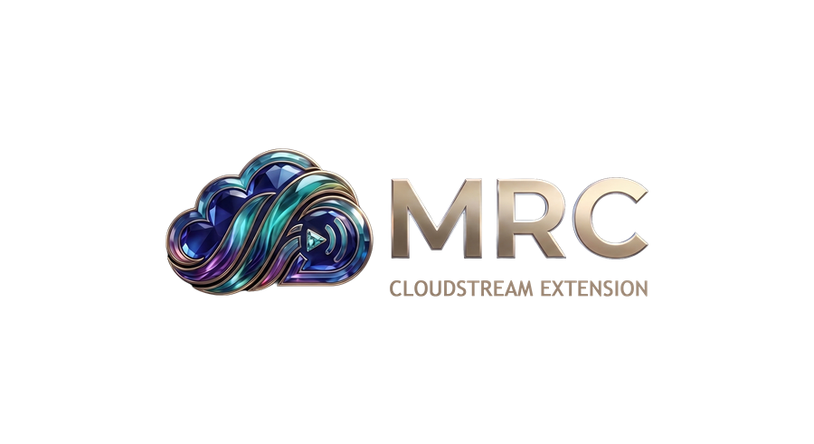

<div align="center">



<br>

# MRC — CloudStream Türkçe Eklenti Deposu

**Film • Dizi • Anime • Çizgi Film — Türkçe, reklamsız, tek depoda.**

[](README.md)
[](README.en.md)
[](https://github.com/recloudstream/cloudstream)
[](#-dmca--telif-hakkı-bildirimi)

[🇹🇷 Türkçe](README.md) • [🇬🇧 English](README.en.md)

</div>

---

## ⚡ Kurulum (2 dakika)

> 📌 **Öneri:** Eklentileri en iyi deneyimle kullanmak için CloudStream'in **pre-release (ön sürüm / Beta)** build'ini öneriyoruz. Bu sürüm kırmızı logolu **"CloudStream Beta"** olarak ayrı bir uygulama halinde kurulur ve stabil sürümün yanında çalışabilir (ikisi birbirini etkilemez). Stabil 4.8.0'a göre daha yeni API'ler içerir: çoklu ses/dublaj ayrımı, arka plan görseli, yaş sınırı, sağlayıcı bazlı zaman aşımı, çok parçalı video desteği ve daha fazlası. Bazı eklentilerimiz bu yeni özellikleri kullanıyor; ön sürümde en sağlıklı çalışırlar.
> **İndirme:** <https://github.com/recloudstream/cloudstream/releases> → en üstteki **Pre-release Build** (`app-prerelease-release.apk`).

1. **CloudStream uygulamasını kurun** (4.8.0 ve üzeri). En iyi sonuç için **Pre-release Build**.
2. Uygulamada **Ayarlar → Eklentiler → Depo Ekle** bölümüne girin.
3. `Depo ismi` kısmını boş bırakıp `Depo URL'si` kısmına şu adresi yapıştırın:

```
https://raw.githubusercontent.com/lepotane/MRC-builds/builds/repo.json
```

4. Depo eklendikten sonra listeden istediğiniz eklentiyi kurun. **Güncellemeler otomatik gelir.**

> **Not:** `!mrc-cs` kısa kodu hazır (`py.md/mrc-cs`) ama şu an **sadece beta sürümlerde** çalışıyor. Stabil sürüme gelince burası güncellenecek.
>
> **Alternatif kısa kod:** `mrc-cs` (Cutt.ly yerine TinyURL üzerinden) — **stabil sürümlerde de çalışır**: <https://tinyurl.com/mrc-cs>

---

## 🧩 Eklenti Listesi ve Güncel Durum

<!-- EKLENTI-LISTESI-SITEDE -->

Depodaki **66 eklentinin** tam listesini, sürümlerini ve **canlı çalışma durumunu** her zaman güncel olarak sitemizden görebilirsiniz:

<div align="center">

### 👉 [Eklentilerin Güncel Durumunu Görüntüle](https://lepotane.github.io/mrc-site/)

[](https://lepotane.github.io/mrc-site/)

<sub>Liste her yayında otomatik güncellenir; tüm eklentiler her gün sağlık kontrolünden geçer.</sub>

</div>

---

## 🛡️ Kalite ve Otomasyon

Depo, eklentilerin **sessizce bozulmaması** için otonom kontrol sistemine sahiptir:
tasarım değişikliği tespiti (selector drift), günlük site sağlık taraması, örnek yayın
linki doğrulaması ve alan adı değişimlerinde otomatik adres keşfi. Sonuçlar her sabah
raporlanır; sorunlu eklentiler kullanıcıya ulaşmadan işaretlenir.

---

## ⚖️ DMCA / Telif Hakkı Bildirimi

<div align="center">

**⚠️ BU DEPO HİÇBİR VİDEO, FİLM, DİZİ VEYA MEDYA DOSYASI BARINDIRMAZ, SUNMAZ VE YAYINLAMAZ.**

</div>

### Bağımsızlık beyanı

- **Biz bir içerik sağlayıcı değiliz.** Bu depo yalnızca, **herkese açık web sitelerini** kullanıcının kendi cihazında görüntülemeyi kolaylaştıran **açık kaynak kodlu eklentiler** içerir.
- **Hiçbir sunucumuz yok.** Ne bir CDN'imiz, ne depolama alanımız, ne de bir akış (stream) altyapımız vardır. Video akışı, **tamamen üçüncü taraf siteler ile kullanıcı arasında** gerçekleşir.
- **Hiçbir içeriği kopyalamayız, barındırmayız, yüklemeyiz, önbelleğe almayız veya yeniden yayınlamayız.**
- **Sitelerle hiçbir bağımız, ortaklığımız, sponsorluğumuz veya resmi ilişkimiz yoktur.** Eklentiler, herhangi bir tarayıcının yapacağı isteği yapan bir istemciden ibarettir.
- **Hiçbir telifli materyalin dağıtımını teşvik etmiyoruz.** Kullanıcılar, içeriği yalnızca **yasal hakları olduğu ölçüde** izlemekle yükümlüdür.
- Eklentiler **eğitim ve kişisel kullanım** amacıyla, açık kaynak lisansı (GPL-3.0) altında paylaşılır.

### DMCA bildirimi nereye gönderilmeli?

Telif hakkı ihlali iddiaları **bize değil**, içeriği fiilen barındıran **ilgili web sitesinin sahibine, barındırıcısına (hosting) veya alan adı kayıt kuruluşuna** yöneltilmelidir. Biz:

1. İçeriği **elimizde tutmadığımız** için kaldıracak bir dosyamız yoktur;
2. İçeriğin **yayınını kontrol etmediğimiz** için erişimi kesecek bir yetkimiz yoktur;
3. Yalnızca **istemci tarafında çalışan** bir eklenti kodu yayınlarız.

Bir eklentinin **hedeflediği site** kapatılırsa veya içeriğini kaldırırsa, eklenti de otomatik olarak işlevsiz kalır — teknik olarak başka türlü çalışması mümkün değildir.

### Sorumluluk reddi

- Eklentiler "olduğu gibi" (as-is), **hiçbir garanti olmaksızın** sunulur.
- Kullanıcı, eklentileri kullanarak **kendi ülkesindeki yasalara** uymakla yükümlüdür.
- Geliştiriciler, eklentilerin kullanımından doğabilecek **doğrudan veya dolaylı hiçbir zarardan sorumlu tutulamaz.**
- İçerik sağlayıcı sitelerle **hiçbir ticari bağımız yoktur**; hiçbir reklam, abonelik veya ödeme geliri elde etmiyoruz.

### Hak sahipleri için

Hakkınızda ihlal barındıran bir **site** olduğunu düşünüyorsanız, lütfen ilgili sitenin barındırıcısına başvurun. Eklenti kodunun kendisi içerik içermez; bu nedenle kaldırılması, ihlal edilen eserin korunmasını sağlamaz.

---

<div align="center">


**❤️ ile MRC — Türkçe CloudStream topluluğu için**

[🇬🇧 Read this in English](README.en.md)

</div>
